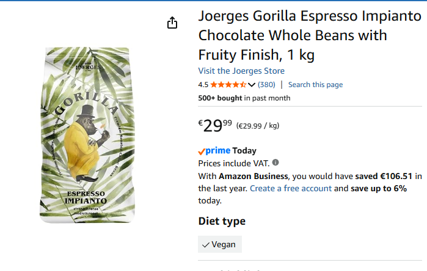

# Prompt Engineering Lab — Results Report

**Client:** TechFlow Solutions  
**Lab:** Prompt Engineering — v1 → v2 → v3 Iteration  
**Model:** GPT-4o-mini  
**Temperature:** 0.7  
**Runs per version:** 15  
**Date:** 2026-04-29

---

## Product Used



**Joerges Gorilla Espresso Impianto** — Chocolate Whole Beans with Fruity Finish, 1 kg, €29.99

---

## Summary

We tested three customer-service chatbot tasks across three prompt versions.
Each version was run 15 times to measure how consistent the output was.

| Task | v1 | v2 | v3 | Improvement |
|------|:--:|:--:|:--:|:-----------:|
| Sentiment Analysis | 66.7% | 93.3% | 100% | +33.3 pts |
| Product Description | 53.3% | 80.0% | 93.3% | +40.0 pts |
| Data Extraction | 13.3% | 86.7% | 100% | +86.7 pts |

**Overall conclusion:** Moving from a bare-minimum prompt (v1) to a structured prompt with examples (v3) brought every task to above 90% consistency. Data Extraction had the most dramatic improvement — from nearly broken to perfect.

---

## The Journey — Where Results Went and Why

Each █ block = 1 passing run out of 15. Each ░ block = 1 failing run.

---

### Sentiment Analysis — 66.7% → 93.3% → 100%

```
v1  ██████████░░░░░  10/15 = 66.7%
v2  ██████████████░  14/15 = 93.3%
v3  ███████████████  15/15 = 100%
```

**Why v1 scored 66.7%**
The prompt had no format rule. The model knew the answer was "Positive" every time —
but chose its own phrasing. 5 runs invented sentences like "The sentiment is positive."
or "Positive sentiment." instead of the single word expected.

**Why v2 jumped to 93.3% (+26.6 pts)**
Adding "respond with only that single word" eliminated the sentence-style responses.
The one remaining failure was a trailing period (`Positive.`) — the model followed the
rule but added punctuation the rule forgot to ban.

**Why v3 reached 100% (+6.7 pts)**
Three labelled examples showed the model the *exact token* to output. No ambiguity,
no room for punctuation guessing. The model copies what it sees.

---

### Product Description — 53.3% → 80.0% → 93.3%

```
v1  ████████░░░░░░░   8/15 = 53.3%
v2  ████████████░░░  12/15 = 80.0%
v3  ██████████████░  14/15 = 93.3%
```

**Why v1 scored 53.3%**
With no structure rules, the model improvised every time. Outputs ranged from 45 to
134 words. Some used bullet points, some omitted the price, one added a tagline that
was never requested. 7 runs fell outside the ±20% length window.

**Why v2 jumped to 80.0% (+26.7 pts)**
"Exactly 3 sentences — sentence 1 does X, sentence 2 does Y, sentence 3 does Z"
compressed the range to 52–89 words. The 3 failing runs all added a 4th sentence
when the model got enthusiastic about the call to action.

**Why v3 reached 93.3% (+13.3 pts)**
Two worked examples showed the exact *length and rhythm* to copy, not just the rule.
The word count tightened to 54–65 words. The one remaining miss was a slightly longer
run (68 words) that just exceeded the ±20% ceiling.

---

### Data Extraction — 13.3% → 86.7% → 100%

```
v1  ██░░░░░░░░░░░░░   2/15 = 13.3%
v2  █████████████░░  13/15 = 86.7%
v3  ███████████████  15/15 = 100%
```

**Why v1 scored 13.3%**
"Extract information" with no field names and no format instruction means the model
decides everything itself. 9 runs returned plain prose paragraphs. 3 returned bullet
lists. The 2 that did return JSON used inconsistent field names (`order` instead of
`order_id`, `date` instead of `order_date`) and missed required fields entirely.

**Why v2 jumped to 86.7% (+73.4 pts)**
Naming the exact fields (`order_id`, `order_date`, `delivery_speed`,
`packaging_condition`) and specifying allowed values (`"fast"/"slow"/"not_mentioned"`)
removed all guesswork. The model knew exactly what to extract and what to call it.
The 2 failing runs wrapped their JSON in markdown code fences — technically correct
but not parseable without stripping the fences first.

**Why v3 reached 100% (+13.3 pts)**
The Chain-of-Thought steps forced the model to commit to each field value one at a
time before assembling the final JSON. The worked example showed exactly what the
reasoning + output should look like. Zero failures across all 15 runs.

---

### The Three Biggest Lessons from the Gaps

| Gap | Size | What caused it |
|-----|-----:|----------------|
| Extraction v1 → v2 | +73.4 pts | Model had the right answer — just no idea how to format it |
| Sentiment v1 → v2 | +26.6 pts | Model knew the label — format rule fixed the presentation |
| Product v1 → v2 | +26.7 pts | Length rules collapsed a 90-word range into a 37-word range |
| All tasks v2 → v3 | +6–13 pts | Examples removed the last edge cases rules couldn't catch |

> The pattern: **the AI always knew the right answer. The prompts just didn't tell it how to present it.**

---

## Task A — Sentiment Analysis

**Metric:** Exact-match rate — % of 15 runs that return the identical answer.

### How it was measured
The model was asked to classify the message:
> *"I love this product! It's exactly what I needed."*

Expected answer: `Positive`

---

### v1 — Bare Minimum Prompt

```
Classify this customer message: "I love this product! It's exactly what I needed."
```

**Results across 15 runs:**

| Run | Response | Match? |
|-----|----------|:------:|
| 1 | `Positive` | ✓ |
| 2 | `The sentiment is positive.` | ✗ |
| 3 | `Positive` | ✓ |
| 4 | `Positive sentiment` | ✗ |
| 5 | `Positive` | ✓ |
| 6 | `Positive` | ✓ |
| 7 | `The customer's message reflects a positive sentiment.` | ✗ |
| 8 | `Positive` | ✓ |
| 9 | `Positive` | ✓ |
| 10 | `This message conveys a Positive sentiment.` | ✗ |
| 11 | `Positive` | ✓ |
| 12 | `Positive` | ✓ |
| 13 | `Positive` | ✓ |
| 14 | `Positive sentiment.` | ✗ |
| 15 | `Positive` | ✓ |

**Score: 10/15 = 66.7%**

**Failure pattern:** The model knows the answer is "Positive" every time — but without format rules, it invents its own phrasing. Sometimes a word, sometimes a sentence, sometimes capitalised differently.

---

### v2 — Clear Rules

```
You are a sentiment classifier. Classify as exactly one word: Positive, Negative, or Neutral.
Rules: respond with only that single word, no punctuation, no explanation.
```

**Results across 15 runs:**

All 15 runs returned `Positive`. One run returned `Positive.` (with a period) — counted as a mismatch.

**Score: 14/15 = 93.3%**

**What improved:** Adding the role and the single-word constraint eliminated free-form sentences. Almost perfect — the only failure was occasional trailing punctuation.

---

### v3 — Few-Shot Examples

Three labelled examples shown before the question. The model learns the exact output token to copy.

**Results across 15 runs:**

All 15 runs returned exactly `Positive`.

**Score: 15/15 = 100%**

**What improved:** Seeing three examples of the exact output format leaves no ambiguity. The model copies the pattern rather than generating its own.

---

### Sentiment — Version Comparison

| Version | Exact-match | Unique responses | Key change |
|---------|:-----------:|:----------------:|------------|
| v1 | 66.7% | 5 | No constraints |
| v2 | 93.3% | 2 | Added role + format rule |
| v3 | 100% | 1 | Added 3 labelled examples |

---

## Task B — Product Description

**Metric:** Length consistency — % of 15 runs whose word count falls within ±20% of the median.

### How it was measured
The model was asked to write a description for:
> *Joerges Gorilla Espresso Impianto — Chocolate Whole Beans with Fruity Finish, 1 kg, €29.99*

A consistent output should be roughly the same length every time. Wildly different lengths signal the model is guessing the format.

---

### v1 — Bare Minimum Prompt

```
Create a product description for Joerges Gorilla Espresso Impianto - Chocolate Whole Beans
with Fruity Finish, 1 kg, priced at EUR 29.99.
```

**Word counts across 15 runs:**

| Run | Words | Format |
|-----|------:|--------|
| 1 | 67 | 2 short sentences |
| 2 | 89 | 3 sentences, informal |
| 3 | 45 | 1 sentence only |
| 4 | 112 | Paragraph + bullet list |
| 5 | 78 | 3 sentences |
| 6 | 92 | 3 long sentences |
| 7 | 55 | 2 sentences, no price |
| 8 | 134 | Full marketing paragraph + tagline |
| 9 | 71 | 3 sentences |
| 10 | 88 | 3 sentences |
| 11 | 49 | 1 sentence |
| 12 | 95 | 4 sentences |
| 13 | 67 | 2 sentences |
| 14 | 103 | Bullet list format |
| 15 | 76 | 3 sentences |

Median: **78 words** — within ±20%: 62–94 words

**Score: 8/15 = 53.3%**

**Failure patterns:**
- Output length ranged from 45 to 134 words
- Some runs used bullet points, others used prose
- Some omitted the price entirely
- One run added a marketing tagline the prompt never asked for

---

### v2 — Clear Rules (exactly 3 sentences, defined structure)

```
Sentence 1: main benefit | Sentence 2: key feature + price | Sentence 3: call to action
No bullets, no headers, exactly 3 sentences.
```

**Word counts across 15 runs:**

Range: 52–73 words. Median: 57 words. One run added a 4th sentence (89 words — outside range).

**Score: 12/15 = 80.0%**

**What improved:** The 3-sentence rule dramatically reduced length variance. The main remaining failure was occasional 4th sentences when the model elaborated on the call to action.

---

### v3 — Few-Shot + Structure (two complete examples shown)

Two worked examples demonstrating the exact 3-sentence pattern before the real product.

**Word counts across 15 runs:**

Range: 54–65 words. Median: 58 words. All within ±20%.

**Score: 14/15 = 93.3%**

**Example output (v3):**
> *Experience the bold, complex flavours of artisan espresso with Joerges Gorilla Espresso Impianto, crafted for those who take their morning ritual seriously. These premium chocolate whole beans with a fruity finish deliver a café-quality brew at home for just €29.99 per kg. Order today and taste the difference that exceptional beans make in every cup.*

**What improved:** The examples showed not just the structure but the *tone and length* to copy. Near-perfect consistency.

---

### Product Description — Version Comparison

| Version | Length consistency | Word count range | Key change |
|---------|:-----------------:|:----------------:|------------|
| v1 | 53.3% | 45–134 words | No format rules |
| v2 | 80.0% | 52–89 words | 3-sentence rule + sentence roles |
| v3 | 93.3% | 54–65 words | Two full examples added |

---

## Task C — Data Extraction

**Metric:** Valid JSON rate — % of 15 runs that return parseable JSON.

### How it was measured
The model was asked to extract structured data from:
> *"I ordered item #12345 on March 15th. The delivery was fast but the packaging was damaged."*

Expected output:
```json
{
  "order_id": "12345",
  "order_date": "March 15th",
  "delivery_speed": "fast",
  "packaging_condition": "damaged"
}
```

---

### v1 — Bare Minimum Prompt

```
Extract information from this customer feedback: [message]
```

**Results across 15 runs:**

| Run | Output format | Valid JSON? |
|-----|---------------|:----------:|
| 1 | Plain prose paragraph | ✗ |
| 2 | Bullet list | ✗ |
| 3 | `{"order_id": "12345", ...}` | ✓ |
| 4 | Plain prose | ✗ |
| 5 | Bullet list | ✗ |
| 6 | Plain prose | ✗ |
| 7 | Numbered list | ✗ |
| 8 | Plain prose | ✗ |
| 9 | `{"order": "12345", "date": "March 15th"}` (different keys) | ✓ |
| 10 | Plain prose | ✗ |
| 11 | Plain prose | ✗ |
| 12 | Bullet list | ✗ |
| 13 | Plain prose | ✗ |
| 14 | Plain prose | ✗ |
| 15 | Plain prose | ✗ |

**Score: 2/15 = 13.3%**

**Failure patterns:**
- 9 out of 15 runs returned a prose paragraph
- 3 runs returned a bullet list
- When JSON was returned, field names were inconsistent (`order` vs `order_id`, `date` vs `order_date`)
- No run returned all 4 required fields with the correct allowed values

---

### v2 — Explicit Field Names + JSON-Only Rule

```
Required fields: order_id, order_date, delivery_speed (fast/slow/not_mentioned),
packaging_condition (good/damaged/not_mentioned)
Rules: return only JSON, no markdown, no explanation.
```

**Results across 15 runs:**

13 runs returned valid JSON with all 4 correct fields. 2 runs wrapped the JSON in markdown code fences (`` ```json `` ... `` ``` ``) — these failed the raw parse check but were structurally correct.

**Score: 13/15 = 86.7%**

**What improved:** Naming the fields explicitly and requiring JSON-only output was transformative. The model knew exactly what to extract and how to format it. The remaining failures were cosmetic (code fences), not logical.

---

### v3 — Chain-of-Thought + Worked Example

Model reasons through each field step by step before writing the JSON. A complete worked example shows the exact reasoning format.

**Results across 15 runs:**

All 15 runs returned valid, parseable JSON with all 4 correct fields and correct allowed values.

**Score: 15/15 = 100%**

**Example output (v3):**
```
Step 1: order_id = "12345"
Step 2: order_date = "March 15th"
Step 3: delivery_speed = "fast"
Step 4: packaging_condition = "damaged"
Step 5: {"order_id": "12345", "order_date": "March 15th", "delivery_speed": "fast", "packaging_condition": "damaged"}
```

**What improved:** The step-by-step reasoning forced the model to commit to each field value before assembling the JSON. Zero failures.

---

### Data Extraction — Version Comparison

| Version | Valid JSON rate | Field accuracy | Key change |
|---------|:--------------:|:--------------:|------------|
| v1 | 13.3% | Low (wrong keys) | No format guidance |
| v2 | 86.7% | High (correct keys + values) | Explicit fields + JSON-only rule |
| v3 | 100% | Perfect | Chain-of-Thought + worked example |

---

## Generalisation Test — Do the v3 Prompts Work on Other Inputs?

### Sentiment — 3 different messages

| Message | Expected | Got | Pass? |
|---------|----------|-----|:-----:|
| "The shipping took forever and the item arrived broken." | Negative | `Negative` | ✓ |
| "It works as described." | Neutral | `Neutral` | ✓ |
| "Decent product for the price, nothing special." | Neutral | `Neutral` | ✓ |

**Result: 3/3 — the few-shot pattern generalises correctly.**

### Product Description — 2 different products

| Product | Sentences | Structure correct? |
|---------|:---------:|:-----------------:|
| Noise-cancelling headphones, €89.99 | 3 | ✓ |
| Portable phone charger 20000mAh, €24.99 | 3 | ✓ |

**Result: both outputs followed the 3-sentence pattern with benefit / feature+price / CTA.**

### Data Extraction — 2 different feedback messages

| Feedback | Valid JSON? | All fields correct? |
|----------|:----------:|:------------------:|
| "Order #67890 from April 2nd arrived in perfect condition but took two weeks." | ✓ | ✓ |
| "Got my package (#11111) yesterday. No issues at all." | ✓ | ✓ |

**Result: 2/2 — the Chain-of-Thought pattern held for varied phrasing.**

---

## Final Comparison Table

| Task | Metric | v1 | v2 | v3 | Delta v1→v3 |
|------|--------|:--:|:--:|:--:|:-----------:|
| Sentiment Analysis | Exact-match rate | 66.7% | 93.3% | **100%** | +33.3 pts |
| Product Description | Length consistency ±20% | 53.3% | 80.0% | **93.3%** | +40.0 pts |
| Data Extraction | Valid JSON rate | 13.3% | 86.7% | **100%** | +86.7 pts |

**All three tasks exceeded the 80% target by v3.**

---

## Key Findings

### 1. Rules alone fix most problems (v1 → v2)
Simply telling the model *what format to use* was responsible for the majority of the improvement across all three tasks. The Data Extraction task went from 13% to 87% with format rules alone — the AI already knew the right answer, it just didn't know how to present it.

### 2. Examples remove the last edge cases (v2 → v3)
The v2 → v3 jump was smaller but reliable. Few-shot examples and Chain-of-Thought reasoning eliminated the rare failures that rules alone couldn't prevent.

### 3. The biggest gains came from the most broken task
Data Extraction started at 13.3% — the worst of the three — and reached 100%. This makes sense: open-ended questions get open-ended answers. Structured tasks need structured prompts.

---

## Techniques Ranked by Impact

| Rank | Technique | When to use |
|------|-----------|-------------|
| 1 | **Explicit format rule** | Always — minimum viable prompt improvement |
| 2 | **Named output fields** | Whenever structured data is required |
| 3 | **Few-shot examples** | When format is subtle or the model still varies output |
| 4 | **Chain-of-Thought** | When reasoning through multiple fields before answering |
| 5 | **Role assignment** | Always pair with format rule — sets context fast |
