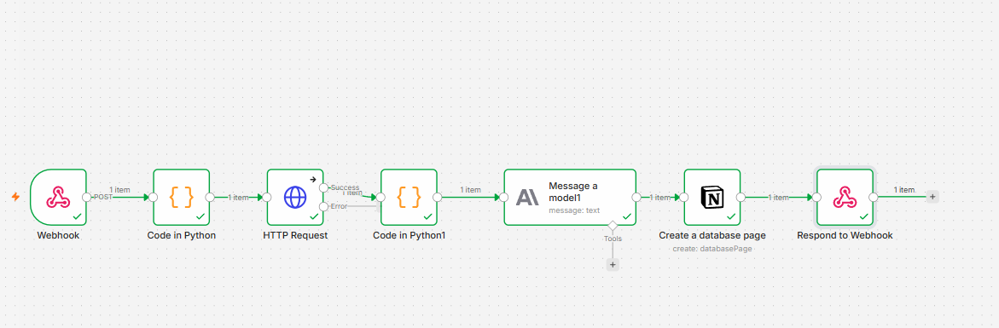
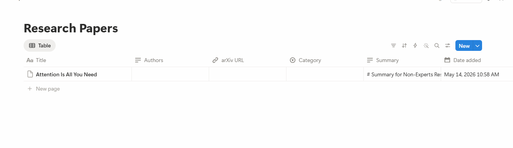

# arXiv Research Paper Summarizer — n8n + Notion

An automated pipeline that takes an arXiv paper URL, fetches the paper metadata, summarizes it using Claude AI, and stores it in a Notion database for future reference.

---

## Workflow Overview



The workflow runs in n8n and consists of 7 nodes:

| Step | Node | What it does |
|------|------|--------------|
| 1 | **Webhook** | Receives a POST request with an arXiv URL |
| 2 | **Code in Python** | Extracts the paper ID from the URL (e.g. `1706.03762`) |
| 3 | **HTTP Request** | Calls the arXiv API and retrieves raw XML metadata |
| 4 | **Code in Python1** | Parses the XML to extract title, authors, abstract, and category |
| 5 | **Message a model (Anthropic)** | Sends the abstract to Claude and gets a 2-3 sentence plain-English summary |
| 6 | **Create a database page (Notion)** | Creates a new row in the Research Papers database |
| 7 | **Respond to Webhook** | Returns a JSON success confirmation to the caller |

---

## Notion Database



Papers are stored in a Notion database called **Research Papers** with the following fields:

- **Title** — Paper name from arXiv
- **Authors** — All author names
- **arXiv URL** — Direct link to the paper
- **Category** — Auto-mapped (CS, ML, Physics, Math, Other)
- **Summary** — AI-generated summary by Claude Haiku
- **Date Added** — Timestamp of when it was added
- **Read?** — Checkbox to track reading status

---

## How to Trigger the Workflow

Send a POST request to your n8n webhook URL:

```powershell
Invoke-RestMethod -Uri "https://your-n8n-instance/webhook/arxiv-summarizer" `
  -Method POST `
  -ContentType "application/json" `
  -Body '{"arxiv_url": "https://arxiv.org/abs/1706.03762"}'
```

Or with curl:

```bash
curl -X POST https://your-n8n-instance/webhook/arxiv-summarizer \
  -H "Content-Type: application/json" \
  -d '{"arxiv_url": "https://arxiv.org/abs/1706.03762"}'
```

---

## Setup

### Required credentials (store in `.env`, never commit):
- `ANTHROPIC_API_KEY` — from [console.anthropic.com](https://console.anthropic.com)
- `NOTION_INTEGRATION_TOKEN` — from [notion.so/profile/integrations](https://www.notion.so/profile/integrations)
- `NOTION_DATABASE_ID` — extracted from your Notion database URL

### Steps:
1. Import `Notion research paper pipeline.json` into n8n
2. Add your Anthropic and Notion credentials in n8n
3. Connect the Notion integration to your Research Papers database
4. Activate the workflow
5. Send a POST request with an arXiv URL

---

## File Map

```
EXTRA 2/
├── Notion research paper pipeline.json   # n8n workflow export
├── Screenshot/
│   ├── 1.png                             # n8n workflow overview
│   └── 2.png                             # Notion database with papers
├── .env                                  # API keys (not committed)
├── .gitignore                            # Excludes .env and system files
└── README.md                             # This file
```
